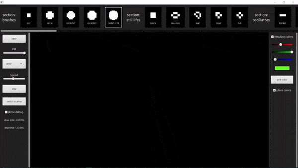
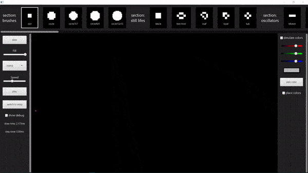
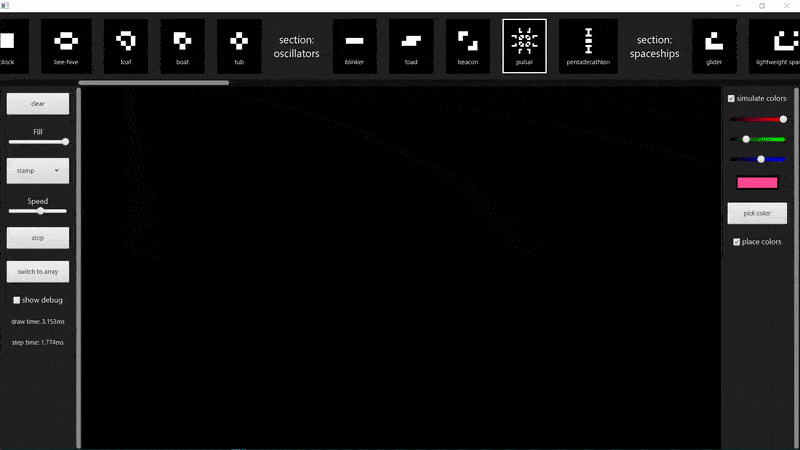
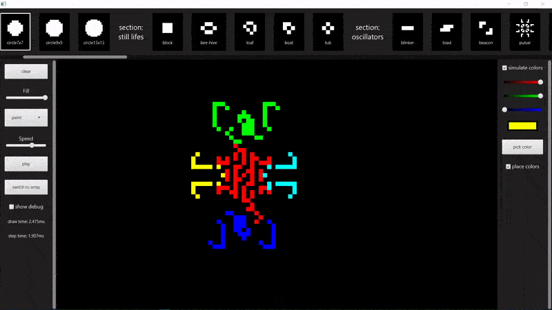
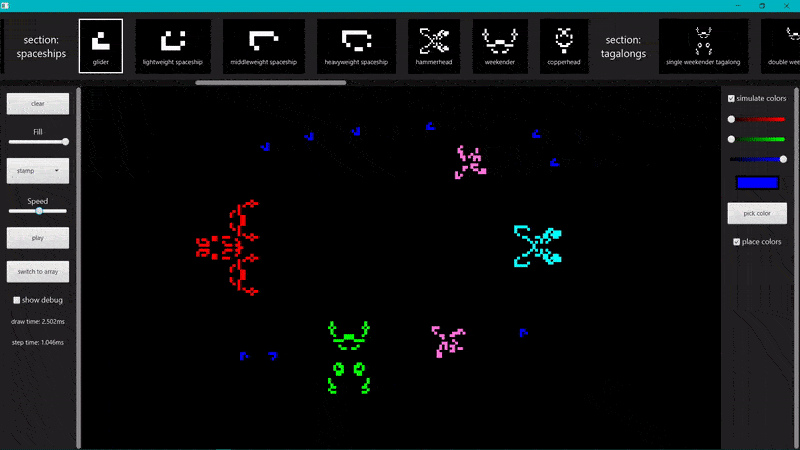
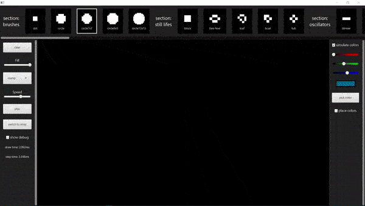
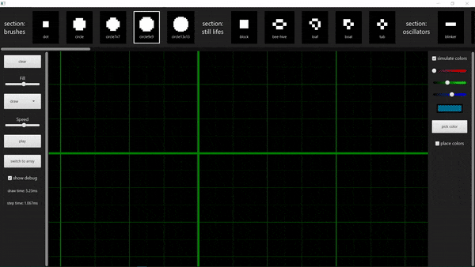

# Game Of Life Editor

***

# Features  

***

### viewport panning
| Key | Action |
|:---:|:---:|
| RMB click and drag | pan viewport |
| RMB click | rotate current brush |
| LMB | Use current action|

***

### Action modes
| Mode | Description|
|:---:|:---:|
| draw | click and drag to use chosen brush|
| erase | click and drag to erase|
| stamp | place one copy of the chosen brush |
| paint | click and drag to change cells' color;

***

### drawing with colors

***

### large and customizable stamp library

***

### color blending

***

### fill percentage

***

### quadtree optimization

***

## Technologies used
* java
* javafx